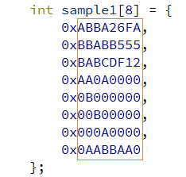

# Задания на практику
 
### Задача 1 "Змейка"

Требуется заполнить змейкой квадратную матрицу так, как показано на рисунке ниже: заполнение происходит с единицы из левого верхнего угла и заканчивается в правом нижнем числом N2, где N – порядок матрицы. Продемонстрировать работу программы при N=4,5,6


Выдавать результат в виде:


### Задача 2 "Калькулятор"

Написать функцию Calc

``` 
int Calc(char *exp);
```

которая вычисляет значение “x” в выражениях вида 2+x=7 или x=5/2. То есть в выражении есть 3 позиции, в которых может находится либо цифра от 0 до 9, либо переменная x. В качестве операций могут выступать умножение *, целочисленное деление /, сложение + вычитание -, взятие остатка % или знак равенства.  То есть шаблон выражения определяется как ZꚚZꚚZ, где Z={0,1,2,4,4,6,7,8,9, x},
а Ꚛ={+,-,*,/,%,=}. Z – всегда цифра или х, то есть Z не может быть, например, числом 25, то есть выражение всегда занимает ровно 5 позиций. Вычисленное значение x, может быть двузначным числом, например “x=8*8” ответ x=64 . Невычислимые выражения типа x*2=3 или x/0=5 или неоднозначные типа 7%x=1 (ответ может быть x=2 или x=6) не допускаются и не должны рассматриваться. При этом x=7/3 – вычислимое выражение. По правилам целочисленного деления 7/3=2.

Необходимо продемонстрировать работу функции Сalc, на следующем минимальном наборе (см. main). Максимальный набор, по-видимому, должен состоять из 24 примеров. За самую короткую программу – бонус в 20%. У меня были студенты, которые уложились в 30 с небольшим строк. Контрольная работа оценивается в 60 баллов. 

```
int main()// +пишем свои примерчики с выводом
{ 
    char *expression[] = {"2+x=5", "x+2=5", "2+x=5", "x-5=2", "5-x=2", "x=5*2", "x*4=8", "9*9=x", "x/2=5", “7%2=x”};
                         
    int len = sizeof(expression) / sizeof(char *);

    for(int i=0; i<len; i++)
        printf("%s x=%d\n",expression[i], Calc(expression[i])); 
}
```

### Задача 3 "ABBA"

Задан массив из 8 целых чисел, например

```
int sample1[8] ={-1413863686, -1146374827, -1162027246, -1442185216, 184549376, 11534336, 655360, 179026592};
```

Если числа этого массива представить в 16-ричном виде, то они образуют матрицу 8x8 из 16-ричных цифр, как показано на рисунке ниже



Необходимо написать функцию int abba(int mas[8]), которой дается массив из 8 целых чисел, а она подсчитывает число уникальных  слов АВВА, которые можно прочесть в 16-ричном представлении этого массива. Двигаться можно только влево/вправо/вверх/вниз.  Например, в приведенном примере, если стоять в левом верхнем углу на букве A, то ABBA можно прочитать по горизонтали или по вертикали или так: вправо-вниз-вниз или так: вправо-вниз-вправо, но не по диагонали. Прочтение из левого верхнего угла вправо-влево не учитывается, так как в этом случае буквы А и В были бы учтены по два раза. Поскольку ABBA – слово палиндром, то обратные прочтения учитывать не надо. То есть АВВА прочтенная вниз из левого верхнего угла (0,0),  и ABBA, прочтенная вверх из позиции (3,0),  –это одно и то же прочтение. 

```
int sample2[8] ={-1430650880, -1157627904, 3145728, -1442185216, 184549376, 11534336, 655360, 3840};
```

Необходимо посчитать число уникальных вхождений ABBA в sample1 и sample2. Программа также будет проверяться на 3-4 других образцах.

### Задача 4

В программе задан многочлен в виде выражения:

```
char *expr = “-2 + x - 3*x^2 +x^4 +5*x^3”;
```

<div>
Степень многочлена не выше 4-й. Знак ‘^’ означает возведение в степень. То есть указанный выше многочлен представляется так y = x^4+5x^3-3x^2+x-2. Коэффициенты при степенях могут быть положительными и отрицательными целыми числами. Если коэффициент равен нулю, то данный член в выражении отсутствует. Возведение в 1-ю степень также не обозначается как «x^1», а просто как «х». Между членами многочлена могут стоять любое количество пробелов (0 или более), но сами слагаемые пишутся без пробелов, то есть «5*x^3», но не «5 *x  ^3» Если коэффициент равен 1, то знак умножения и сам коэффициент опускаются, то есть пишется «-x», а не «-1*x». Перед свободным членом может присутствовать знак + или -. Все члены многочлена и свободный член перечисляются в выражении в произвольном порядке. Для упрощения задачи считать, что все коэффициенты перед х и свободный член состоят из одной цифры, то есть имеют значения от 1 до 9.
<div>

Написать функцию,

```
double polynom(char *expr, double x)
```

которая делает разбор заданного выражения (у каждого может быть свое) и возвращает значение y при заданном x. Программа main должна распечатать вид самого выражения, а также значения y для заданных x = 0.0, 3.14 и -10.5. Рекомендуется отлаживать программу на следующих многочленах:

1)	 x^4+5x^3-3x^2+x-2
2)	-2+5x^3+x
3)	-x^4 + 5

Например,

```
int main() {
    char *expr[] = {"-x^4 + 5", “x^4 +  5*x^3- 3*x^2 + x-2”,”-2 + 5*x^3+x”};
    int size = sizeof(expr)/sizeof(char *);
    double x = 3.14;
    for(int i=0; i<size; i++) 
        printf("y=%s y(%f) returns %f", expr, x, polynom(expr, x));
}
```

### Задача 5

Заданы координаты N вершин на плоскости в *произвольном* порядке, не обязательно целочисленные. Необходимо обойти их по часовой стрелке, вернувшись в ту же вершину, так чтобы полученная фигура не имела самопересечений, и вычислить периметр полученного многоугольника.  Многоугольник может получиться невыпуклым. Входные данные: одномерный массив координат вершин, в котором координаты задаются парой чисел с соседними индексами, например, float coord[]={0,0,1,0,0,1} задает треугольник с координатами вершин  A(0,0) B(1,0) C(0,1). Требуется   написать функцию с сигнатурой «float traverse_clockwise(float coord[],int n)»,  где coord - массив координат вершин, а n - число вершин (то есть размерность массива равна 2*n) , которая обходит вершины по часовой стрелке и возвращает длину периметра. Необходимо продемонстрировать работу программы на 3-х примерах: 1) прямоугольник 2) звезда 3) почти правильный 9-угольник. Все вершины задаются в **произвольном** порядке. Представление координат, указанное выше требуется только для головной функции traverse_clockwise. Внутреннее представление может быть любым, удобным для работы. Количество вершин в фигуре не более 50.

Обращаю ваше внимание, что вершины заданы в *произвольном* порядке и если их обходить в порядке следования, то получится фигура с самопересечениями. Для решения задачи необходимо освоить «обход вершин по часовой стрелке». Итак, нужно вычислить значения функции traverse_clockwise для следующих фигур:

1)	float rect[] = {1,5,7,1,7,5,1,1};
2)	float star[] = {3.97, 0.82, 2.26, 3.69, 5.39, 2.16, 2.03, 2.11, 5.36, 4.06};
3)	float enneagon[] ={ 76, 67.1, -8.3, 18, 55, 93.3, 77, 33, 21.3, 99, -20, 50, -8.3, 82, 55, 6.7,  21.3, 0.76};

Для первой фигуры периметр можно легко вычислить в уме, третья фигура задает почти правильный девятиугольник, вписанный в окружность радиусом 50, и формулу периметра можно легко найти в интернете. Вторая фигура – это звезда неправильной формы. Первую и третью фигуру можно использовать для оценки правильности работы своей программы.
