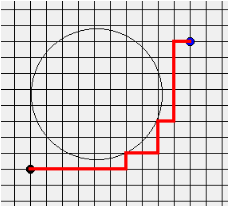
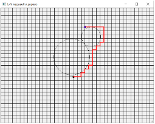

# Задания на практику

### Задание 1. Фонарик (40 баллов)

Двумя кликами поставить фонарик с величиной растра 30 градусов. Начиная с 3-го клика выводить в QMessageBox классификацию точки клика по трем категориям: 1) слева/справа 2) впереди/сбоку/сзади 3) видна/не видна. Усложненный вариант задания представлен на рисунке ниже справа. Требуется закрасить все области вокруг фонарика: желтый все точки видимые в растре фонарика. Синим – точки впереди, но вне растра (темнота впереди). Серым – область сзади фонарика (темнота позади). Зеленым цветом надо закрасить точки сбоку от фонарика, причем необходимо различать точки слева и точки справа.

Пример решения (в этом примере растр 90 градусов)

### Задание 2. Бассейн  (40 баллов)

Вокруг прямоугольного бассейна с водой необходимо расставить произвольное количество круглых и прямоугольных клумб с цветами.

Условия  расстановки клумб такие:

- Клумбы нельзя ставить внутрь бассейна
- Клумбы нельзя ставить на край бассейна так, чтобы они опрокинулись в воду
- Квадратные клумбы по размеру равны 1/5 размера бассейна
- Квадратные клумбы можно ставить друг на друга, если площадь пересечения > 60%
- Квадратные клумбы можно ставить на круглые, если они целиком находятся внутри круга
- Круглые клумбы на круглые ставить нельзя

### Задание 3. Муравей, дерево и муха (100 баллов)

Муравей находится в лесу в точке (x1, y1) и направляется в точку (x2, y2). В лесу растет дерево, основание ствола которого имеет форму круга с центром в точке (x, y) и радиусом r. Дерево, возможно, помешает муравью дойти до цели по прямой. В таком случае ему придется обойти дерево вокруг ствола. Муравей и цель всегда находятся в узле решетки, а дерево не обязательно. Усложненный вариант задания показан на рисунке справа, когда муравей должен обойти два дерева.

Требуется написать программу, которая определит длину кратчайшего пути муравья. 
